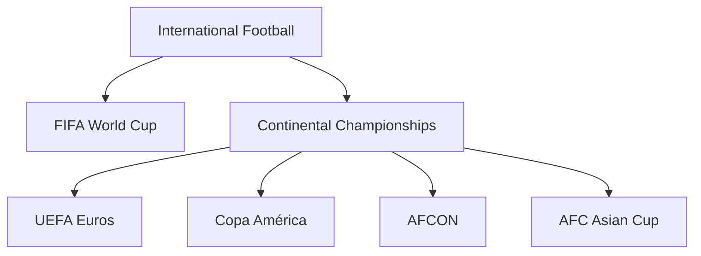
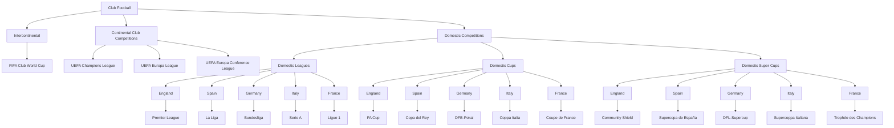

Football (don't call it soccer) is the world’s most popular sport, organized across multiple tiers—from global tournaments between national teams to regional and domestic club competitions.

**Related Projects:** This knowledge forms the foundation for sports apps like [[groundplay-setup|GroundPlay]] and platforms like [[draft it is|Sports TakeHub]] that aim to enhance the fan experience.

## 1. International Competitions (Country vs Country)

- **FIFA World Cup**  
  Held every four years; features 32 national teams from six confederations.

- **UEFA European Championship (Euros)**  
  Every four years, midway between World Cups; 24 European national teams compete.

- **Other Continental Tournaments**  
  - Africa Cup of Nations (AFCON)  
  - AFC Asian Cup  
  - Copa América  

## 2. FIFA Club Competition

- **FIFA Club World Cup**  
  Annual tournament for continental club champions (e.g., UEFA Champions League winners vs. Copa Libertadores winners).

## 3. UEFA Club Competitions (Clubs from Different Countries)

- **UEFA Champions League**  
  Europe’s premier club tournament, featuring top-placed teams from domestic leagues.

- **UEFA Europa League**  
  Second-tier continental competition for clubs just below Champions League spots.

- **UEFA Europa Conference League**  
  Third-tier, introduced in 2021–22 for clubs finishing further down the domestic tables.

- **UEFA Super Cup**  
  One-off match between Champions League and Europa League winners each season.

## 4. Domestic Club Football

### a. Leagues (Double Round-Robin)

| Country  | Top Division | Relegation & Promotion           |
| -------- | ------------ | -------------------------------- |
| England  | Premier League | Bottom 3 ↔ Championship        |
| Spain    | La Liga       | Bottom 3 ↔ Segunda División     |
| Germany  | Bundesliga    | Bottom 2 + play-off ↔ 2. Bundesliga |
| Italy    | Serie A       | Bottom 3 ↔ Serie B              |
| France   | Ligue 1       | Bottom 3 ↔ Ligue 2              |

### b. Domestic Cups (Knock-out)

- **England**: FA Cup, EFL (Carabao) Cup  
- **Spain**: Copa del Rey  
- **Germany**: DFB-Pokal  
- **Italy**: Coppa Italia  
- **France**: Coupe de France  

### c. Domestic Super Cups (One-off)

- **England**: Community Shield (PL winner vs. FA Cup winner)  
- **Spain**: Supercopa de España (La Liga & Copa del Rey finalists)  
- **Germany**: DFL-Supercup (Bundesliga vs. DFB-Pokal winner)  
- **Italy**: Supercoppa Italiana (Serie A vs. Coppa Italia)  
- **France**: Trophée des Champions (Ligue 1 vs. Coupe de France)  

## 5. Season Calendar

- **August–May**: Domestic leagues, domestic cups, and UEFA competitions run simultaneously.  
- **January**: Some leagues pause for winter break; domestic super cups are often played.  
- **June–July**: International tournaments (World Cup, Euros, AFCON, Copa América) take place in their multi-year cycles.

## 6. Visual Representation of Football Competition Structure

### International Football

### Club Football

